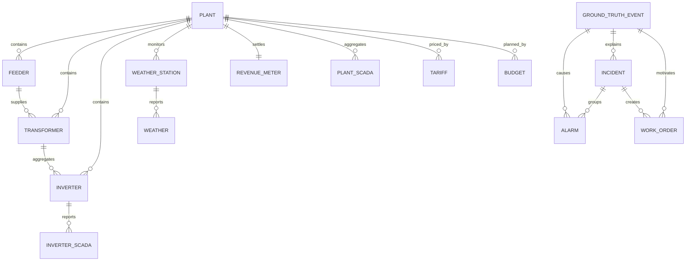

# Energy Operations Intelligence Platform

# Phase 2 Implementation Plan: Physics-Informed Synthetic Data

| Document control | Value |
|---|---|
| Document ID | EOIP-P2-PLAN-001 |
| Version | 1.0.0 |
| Status | Implementation contract |
| Phase | Phase 2 — Synthetic Data Foundation |
| Repository | Energy-Operations-Intelligence-Platform |
| Owner | EOIP synthetic-data workstream |
| Approved runtime | Python 3.12 |
| Default portfolio | 20 utility-scale photovoltaic plants |
| Default telemetry interval | 15 minutes |
| Time standard | UTC |
| Output zone | `data/synthetic/` |

---

## 1. Authority, purpose, and use

This document is the definitive implementation contract for Phase 2 of the Energy Operations Intelligence Platform (EOIP). It converts the high-level system architecture into stable file, interface, data, physics, validation, and test contracts for a reproducible synthetic utility-scale solar portfolio.

Phase 2 implementers shall follow this document file by file. Architectural changes require an explicit update to this plan before dependent code is changed. Production code shall not silently rename datasets, fields, public interfaces, identifiers, directories, or ownership boundaries defined here.

This plan is intentionally more precise than an ordinary roadmap. It defines:

- what Phase 2 produces and does not produce;
- the complete `eoip.synthetic` package and its dependency direction;
- canonical entities, relationships, schemas, identifiers, units, and enumerations;
- the physical and operational model used to create realistic data;
- deterministic event injection and ground-truth lineage;
- validation rules and quality gates;
- exact output files and manifest requirements;
- file-by-file implementation contracts and build order;
- unit, integration, performance, reproducibility, and acceptance tests;
- assumptions, limitations, risks, and change-control rules.

If this plan conflicts with `SYSTEM_ARCHITECTURE.md`, the system architecture controls cross-phase ownership and this document controls Phase 2 details. The discrepancy must then be resolved in both documents before implementation continues.

### 1.1 Normative language

The words **shall** and **must** identify mandatory requirements. **Should** identifies a preferred requirement that may be varied only with a recorded reason. **May** identifies an optional implementation choice. Numeric ranges are inclusive unless stated otherwise.

### 1.2 Design principles

1. Reproducibility: identical configuration, seed, and code version produce byte-equivalent logical records.
2. Causal consistency: weather influences expected production; faults influence telemetry; telemetry states influence alarms; alarms may form incidents; incidents may produce work orders.
3. Ground-truth preservation: every injected event retains machine-readable labels without leaking those labels into ordinary operational features.
4. Single ownership: formulas, schemas, random-state creation, identifier creation, and file writing each have one module owner.
5. Referential integrity: no fact record may reference an entity outside the same generated portfolio.
6. Portfolio realism: plants differ in size, technology, climate, age, topology, degradation, losses, tariff, and reliability.
7. Analytical usefulness: outputs support later KPI, forecasting, anomaly-detection, predictive-maintenance, and recommendation phases.
8. Controlled imperfection: realistic missingness and sensor defects are explicit injected events, not accidental generator errors.
9. Separation of concerns: generation creates files; Phase 3 ETL validates and loads them; Phase 2 never writes PostgreSQL.
10. Inspectability: each run publishes configuration, seed, row counts, checksums, validation results, and lineage.

---

## 2. Phase objectives

### 2.1 Business objective

Create a credible, explainable virtual solar portfolio that lets EOIP demonstrate operations consulting questions without confidential client data. The dataset must support analysis of generation performance, availability, alarm burden, incident response, maintenance effectiveness, energy loss, revenue exposure, and asset risk.

The portfolio must allow a reviewer to trace a business observation—such as lost revenue at a plant—back through energy loss, an operational incident, alarms, affected equipment, and the injected physical event that caused it.

### 2.2 Technical objective

Implement a deterministic, configuration-driven, physics-informed generator that produces internally consistent master, time-series, operational, commercial, and ground-truth datasets at portfolio scale. It must expose composable Python interfaces, write versioned Parquet outputs plus a JSON manifest, and validate both individual tables and cross-table causal relationships.

### 2.3 In scope

- portfolio and topology master data;
- plants, inverters, transformers, feeders, weather stations, and revenue meters;
- clear-sky-informed and stochastic weather observations;
- inverter and plant SCADA telemetry;
- planned and unplanned ground-truth events;
- alarm, incident, and work-order lifecycles;
- tariffs and annual/monthly operating budgets;
- generation-run metadata, checksums, and validation reports;
- controlled telemetry missingness, stuck sensors, drift, clipping, derating, outages, soiling, and equipment faults;
- tests and one command-line generation entry point.

### 2.4 Out of scope

- database DDL, PostgreSQL, and TimescaleDB loading;
- ETL into raw, interim, or processed zones;
- production KPI calculation and executive reporting;
- model training, forecasting, anomaly detection, and recommendations;
- live SCADA connectivity or real client data;
- AC power-flow, harmonic, protection-coordination, or electromagnetic transient simulation;
- module/string-level digital-twin simulation;
- market bidding, dispatch optimization, or battery energy storage;
- Streamlit, FastAPI, Docker, and cloud deployment.

### 2.5 Deliverables

1. The `src/eoip/synthetic/` package defined in Section 8.
2. Phase 2 additions to configuration and shared constants explicitly listed in this plan.
3. `scripts/generate_synthetic_data.py` as a thin CLI adapter.
4. Unit, integration, performance, and acceptance tests defined in Section 24.
5. All datasets in Section 15 for a smoke profile and the default portfolio profile.
6. A run manifest, dataset checksums, validation summary, and human-readable generation report.
7. Updated README instructions after implementation.

### 2.6 Definition of Done

Phase 2 is done only when all of the following are true:

- every planned production file exists in its approved location and has its specified responsibility;
- every public function and class is typed and documented;
- the smoke profile completes locally from a clean checkout;
- the default profile represents 20 plants and approximately 500 inverters for one complete calendar year;
- every output schema matches this contract;
- primary-key uniqueness and all foreign-key checks pass;
- timestamps are UTC-aware in memory and normalized to UTC in output;
- engineering, causal, lifecycle, and value-range validation passes;
- same-seed logical output is identical across two consecutive runs;
- a different seed changes stochastic values while preserving schemas and invariants;
- every injected event appears in `ground_truth_events` and has detectable consequences in the appropriate operational dataset;
- generated output contains no NaN or infinity except fields explicitly declared nullable;
- Black, Ruff, mypy, unit, integration, and acceptance checks pass;
- total branch coverage for `eoip.synthetic` is at least 90%, with 100% coverage of critical physics and identifier functions;
- the default profile meets the runtime and memory budget in Section 23;
- the run manifest contains configuration, seeds, versions, counts, time bounds, and SHA-256 checksums;
- no Phase 2 module connects to a database or imports a higher architectural layer.

### 2.7 Acceptance criteria

| ID | Criterion | Evidence |
|---|---|---|
| P2-AC-001 | Generate 20 active plants with valid geographic and capacity attributes | `plants.parquet`; schema report |
| P2-AC-002 | Generate 450–550 inverters portfolio-wide by default | manifest row count |
| P2-AC-003 | Produce a gap-free canonical 15-minute UTC time grid before intentional defects | time-grid tests |
| P2-AC-004 | Night-time active power and irradiance are effectively zero | engineering validation |
| P2-AC-005 | Daytime power responds monotonically to usable irradiance absent events and clipping | physics unit tests |
| P2-AC-006 | Cell temperature, efficiency, losses, and capacity constrain power | formula tests |
| P2-AC-007 | Every fact foreign key resolves | referential-integrity report |
| P2-AC-008 | Events cause consistent SCADA, alarm, incident, and work-order effects | causal integration tests |
| P2-AC-009 | Tariffs and budgets cover every plant and required period | commercial validation |
| P2-AC-010 | Same configuration and seed reproduce the same logical datasets | reproducibility test |
| P2-AC-011 | Ground-truth data is separated from ordinary operational files | output-layout test |
| P2-AC-012 | Output checksums and row counts are recorded | `manifest.json` |
| P2-AC-013 | Invalid configuration fails before partial publication | failure-atomicity test |
| P2-AC-014 | All public imports remain stable through `eoip.synthetic` | public-API test |
| P2-AC-015 | Default run stays within performance budget | benchmark report |

### 2.8 Quality gate

The phase gate is a single pass/fail decision. Approval requires:

```text
Formatting + lint + type checks
                AND
Unit + integration + acceptance tests
                AND
Schema + referential + temporal validation
                AND
Engineering + causal + lifecycle validation
                AND
Reproducibility + performance evidence
                AND
Complete manifest and documentation
```

Warnings may be published only for pre-approved advisory rules. Any mandatory-rule failure prevents publication of the run directory and causes `DataGenerationError` or `ValidationError` as appropriate.

---

## 3. Portfolio scenario and generation profiles

### 3.1 Default scenario

The default dataset models a geographically distributed portfolio of 20 grid-connected, utility-scale PV plants. Plant commissioning years, technologies, climatic profiles, and capacities vary. Aggregate AC capacity should be 750–1,250 MW, with individual plants between 20 and 100 MW AC. The target inverter population is 450–550.

The default period is one complete non-leap calendar year from `2025-01-01T00:00:00Z` through `2025-12-31T23:45:00Z`. The end is represented in configuration as an exclusive bound of `2026-01-01T00:00:00Z`.

### 3.2 Named profiles

| Profile | Plants | Duration | Interval | Purpose |
|---|---:|---:|---:|---|
| `unit` | 1 | 2 days | 15 min | deterministic unit fixtures |
| `smoke` | 2 | 14 days | 15 min | local integration and CI |
| `default` | 20 | 365 days | 15 min | portfolio demonstration |
| `extended` | 20 | 3 years | 15 min | forecasting and degradation studies |

Profiles are named configuration bundles, not separate code paths. Every profile uses the same orchestration, physics, event, validation, and output interfaces.

### 3.3 Expected scale

For a non-leap default year, there are 35,040 timestamps. With 500 inverters, inverter SCADA contains approximately 17.52 million rows. Weather contains approximately 700,800 rows if one station is assigned to each plant. Plant SCADA contains approximately 700,800 rows. Exact counts for event datasets are seed-dependent but bounded by configuration.

### 3.4 Global seed policy

The default global seed is `20250201`. No module may call NumPy's global random functions. `random.Random` shall not be used. One `numpy.random.SeedSequence` is created by `RandomContext`; stable named child sequences are derived for portfolio, weather, degradation, events, telemetry defects, alarms, incidents, work orders, tariffs, and budgets.

Adding a new downstream generator must not perturb random streams already assigned to existing datasets. Named stream keys and their ordering are versioned in the manifest.

---

## 4. Synthetic data scope

### 4.1 Dataset families

| Family | Datasets | Role |
|---|---|---|
| Master | plants, inverters, transformers, feeders, weather stations, revenue meters | stable asset hierarchy and ratings |
| Environmental | weather | physical production driver |
| Operational time series | inverter SCADA, plant SCADA | measured operations |
| Event operations | alarms, incidents, work orders | operational response lifecycle |
| Commercial | tariffs, budgets | revenue and cost context |
| Truth and audit | ground-truth events, manifest, validation report | labels, reproducibility, lineage |

### 4.2 Plants

Each plant represents one grid-connected solar facility. Required variation includes location, latitude/longitude, elevation, timezone metadata, AC/DC capacity, DC/AC ratio, technology, tracking type, commissioning date, degradation rate, nominal loss assumptions, and operational status.

Plant capacity is the authoritative upper bound for plant export. The plant record owns no time-varying values.

### 4.3 Inverters

Inverters are the lowest generated production asset. Each belongs to one plant, transformer, and feeder. Ratings and efficiency curves vary by model. Total inverter AC capacity per plant must be within ±5% of plant AC capacity. Every active inverter has exactly one commissioning date and stable identifiers.

### 4.4 Transformers

Transformers aggregate multiple inverters and belong to one plant and feeder. Their rated MVA must cover connected inverter power with a configured loading margin. Transformer losses contribute to plant-level delivered power but not to inverter terminal power.

### 4.5 Feeders

Feeders group transformers and connect to plant collection buses. Each plant has two to twelve feeders depending on capacity. Feeder capacity shall exceed assigned transformer capacity after diversity assumptions. Feeder events propagate to all downstream transformers and inverters.

### 4.6 Weather stations

Every plant has one primary weather station; selected larger plants may have a secondary station. The primary station provides the weather series used by production physics. Station metadata includes coordinates, elevation, sensor capabilities, calibration date, and status.

### 4.7 Revenue meters

Each plant has exactly one primary point-of-interconnection revenue meter. It measures exported/imported energy at the settlement boundary. Meter readings are represented in plant SCADA for Phase 2; the master file describes the device, accuracy class, and multiplier.

### 4.8 Weather

Weather is a 15-minute station-level series containing solar position, clear-sky reference, cloud-adjusted irradiance, ambient temperature, wind speed, relative humidity, precipitation, module/cell temperature proxy, and data-quality state. Weather must exhibit diurnal, seasonal, and temporally autocorrelated behavior.

### 4.9 SCADA

Two grains are required:

- inverter SCADA: one row per inverter per timestamp;
- plant SCADA: one row per plant per timestamp, aggregated from inverter terminal output and collection/transformer losses, with revenue-meter cumulative energy.

Plant SCADA shall be derived from inverter SCADA rather than generated independently. This is essential to causal consistency.

### 4.10 Alarms

Alarms are event records with raised, acknowledged, cleared, severity, category, source asset, state, and linked ground-truth event. An alarm is an observed control-system symptom. One physical event may create multiple alarms; nuisance alarms may exist without incidents.

### 4.11 Incidents

Incidents group operationally meaningful alarms or observed outages. They include detection, acknowledgement, assignment, restoration, closure, priority, impact classification, affected asset, energy-loss estimate, root-cause category, SLA target, and status history timestamps.

### 4.12 Work orders

Work orders represent maintenance actions created from selected incidents or preventive schedules. They include approval, scheduling, dispatch, start, completion, closure, labor, material cost, action code, finding code, and linked incident/event.

### 4.13 Tariffs

Tariffs define plant-level energy prices in the plant contract currency. Phase 2 supports flat and time-of-use energy rates, effective-date versioning, and optional escalation. Rates remain reference data; production revenue KPIs belong to a later analytics phase.

### 4.14 Budgets

Budgets contain monthly plant targets for energy, revenue, availability, operating expenditure, and planned maintenance expenditure. Targets are generated from expected energy and commercial assumptions, not from realized fault-affected energy.

### 4.15 Ground-truth events

Ground-truth events are the canonical labels for all injected conditions. They contain event type, scope, severity, start/end, affected asset, physical parameters, parent event, and links to downstream operational records. They are excluded from ordinary analytical features unless explicitly used as labels.

---

## 5. Canonical identifiers, enums, units, and time

### 5.1 Identifier formats

Identifiers are uppercase, stable, ASCII, and zero-padded. IDs are deterministic functions of portfolio seed and ordered entity position; they are not random UUIDs.

| Entity | Pattern | Example |
|---|---|---|
| Plant | `PLT-{NNN}` | `PLT-001` |
| Inverter | `{plant_id}-INV-{NNN}` | `PLT-001-INV-001` |
| Transformer | `{plant_id}-TX-{NN}` | `PLT-001-TX-01` |
| Feeder | `{plant_id}-FDR-{NN}` | `PLT-001-FDR-01` |
| Weather station | `{plant_id}-WS-{NN}` | `PLT-001-WS-01` |
| Revenue meter | `{plant_id}-MTR-{NN}` | `PLT-001-MTR-01` |
| Alarm | `ALM-{YYYY}-{NNNNNNNN}` | `ALM-2025-00000001` |
| Incident | `INC-{YYYY}-{NNNNNN}` | `INC-2025-000001` |
| Work order | `WO-{YYYY}-{NNNNNN}` | `WO-2025-000001` |
| Tariff | `TRF-{NNNN}` | `TRF-0001` |
| Budget row | `{plant_id}-{YYYY}-{MM}` | `PLT-001-2025-01` |
| Truth event | `GTE-{YYYY}-{NNNNNNNN}` | `GTE-2025-00000001` |
| Generation run | `RUN-{UTC timestamp}-{seed}` | `RUN-20250803T080000Z-20250201` |

### 5.2 Enumerations

Canonical values shall be Python `StrEnum` members and serialized as lowercase snake case.

| Enum | Values |
|---|---|
| Asset status | `active`, `maintenance`, `retired` |
| Tracking type | `fixed_tilt`, `single_axis` |
| Module technology | `mono_perc`, `topcon`, `thin_film` |
| Inverter topology | `central`, `string` |
| Alarm severity | `info`, `warning`, `minor`, `major`, `critical` |
| Alarm state | `active_unacknowledged`, `active_acknowledged`, `cleared_unacknowledged`, `closed` |
| Incident priority | `p1`, `p2`, `p3`, `p4` |
| Incident status | `open`, `acknowledged`, `assigned`, `in_progress`, `restored`, `closed` |
| Work-order type | `corrective`, `preventive`, `inspection` |
| Work-order status | `created`, `approved`, `scheduled`, `dispatched`, `in_progress`, `completed`, `closed`, `cancelled` |
| Quality flag | `good`, `estimated`, `suspect`, `missing`, `stuck`, `out_of_range` |
| Event scope | `portfolio`, `plant`, `feeder`, `transformer`, `inverter`, `sensor` |
| Event type | values in Section 13.2 |
| Tariff type | `flat`, `time_of_use` |

### 5.3 Units

Column names carry units where ambiguity is possible. Use SI-derived units and these conventions:

- power: `kw` or `mw` as named;
- energy: `kwh` or `mwh` as named;
- irradiance: `w_m2`;
- temperature: `c`;
- voltage: `v`; current: `a`; frequency: `hz`;
- reactive power: `kvar`; apparent power: `kva`;
- wind: `m_s`; precipitation: `mm`; pressure: `hpa`;
- percentages and ratios: decimal fractions where `ratio`, percent values only where `_pct`;
- currency rates: `{currency}_per_mwh` conceptually, stored as `energy_rate_per_mwh` plus `currency`.

### 5.4 Time rules

- Internal timestamps are timezone-aware UTC `pandas.Timestamp`/`DatetimeIndex` values.
- Parquet timestamps use UTC logical types.
- Start bounds are inclusive; end bounds are exclusive.
- Canonical grid timestamps identify interval starts.
- Durations are computed from exact instants, never formatted strings.
- Plant local timezone is metadata for later presentation and tariff-window evaluation only.
- Daylight-saving behavior must not change the UTC telemetry grid.
- Date fields such as commissioning date use ISO calendar dates, not timestamps.

### 5.5 Nullability

Master-data mandatory fields are never null. Event lifecycle timestamps are nullable only when the lifecycle has not reached that state. Sensor values may be null only when the corresponding `quality_flag` is `missing`; the row remains present. An intentionally dropped-row scenario is permitted only for the `telemetry_gap` event and must be recoverable through the ground-truth dataset.

---

## 6. Entity relationship model

### 6.1 Logical model



### 6.2 Cardinality rules

| Parent | Child | Rule |
|---|---|---|
| Plant | Feeder | 2–12 active feeders |
| Plant | Transformer | 2–30 transformers |
| Plant | Inverter | capacity-driven; portfolio total 450–550 |
| Plant | Weather station | 1–2, exactly one primary |
| Plant | Revenue meter | exactly one primary |
| Feeder | Transformer | one or more |
| Transformer | Inverter | one or more |
| Weather station | Weather | one row per grid timestamp except explicit defects |
| Inverter | Inverter SCADA | one row per grid timestamp except explicit dropped-row defects |
| Plant | Plant SCADA | one row per grid timestamp |
| Ground-truth event | Alarm | zero or more |
| Ground-truth event | Incident | zero or one primary incident |
| Incident | Work order | zero or more |
| Plant | Tariff | at least one effective tariff covering generation period |
| Plant | Budget | exactly one row per generated calendar month |

### 6.3 Propagation hierarchy

```text
Portfolio event
  └─ all plants
Plant event
  └─ all feeders → transformers → inverters in plant
Feeder event
  └─ all transformers → inverters on feeder
Transformer event
  └─ all inverters on transformer
Inverter event
  └─ one inverter
Sensor event
  └─ one named measurement channel
```

No generator may rediscover descendants through string parsing. Relationships must be resolved from master-data foreign keys through `PortfolioIndex`.

---

## 7. Dependency and ownership architecture

### 7.1 Approved package dependency direction

```text
scripts/generate_synthetic_data.py
              ↓
eoip.synthetic.cli → eoip.synthetic.pipeline
                             ↓
     generators → physics → events → operations
          ↓           ↓         ↓          ↓
       models ← schemas ← catalogues ← validation
          ↓           ↓         ↓          ↓
          io ← metadata ← random ← timegrid
                             ↓
             eoip.config + eoip.core
```

All arrows point toward dependencies. Circular imports are prohibited.

### 7.2 Single-owner register

| Concern | Sole owner |
|---|---|
| Phase configuration dataclasses | `synthetic/config.py` |
| Public enums | `synthetic/enums.py` |
| Domain dataclasses | `synthetic/models.py` |
| DataFrame schema declarations | `synthetic/schemas.py` |
| ID construction | `synthetic/identifiers.py` |
| Random streams | `synthetic/random.py` |
| Canonical time grid | `synthetic/timegrid.py` |
| Solar/weather equations | `synthetic/physics/solar.py`, `weather.py` |
| PV/electrical equations | `synthetic/physics/pv.py`, `electrical.py` |
| Event definitions | `synthetic/events/catalogue.py` |
| Event scheduling | `synthetic/events/scheduler.py` |
| Event effect application | `synthetic/events/effects.py` |
| Alarm mapping | `synthetic/operations/alarm_catalogue.py` |
| Incident lifecycle | `synthetic/operations/incidents.py` |
| Work-order lifecycle | `synthetic/operations/work_orders.py` |
| Dataset writing | `synthetic/io.py` |
| Manifest/checksums | `synthetic/metadata.py` |
| Phase-level validation | `synthetic/validation/*` |
| End-to-end orchestration | `synthetic/pipeline.py` |

### 7.3 Import rules

- Absolute imports begin with `eoip`.
- Generator modules may depend on models, schemas, physics, catalogues, random context, and time grid.
- Physics modules are pure and may depend only on NumPy/Pandas plus stable synthetic models/constants.
- Validation modules may read all generated frames but may not mutate them.
- Output modules may serialize frames but may not create domain values.
- `__init__.py` exports only the intentionally stable public API.
- No module imports `dashboard`, `analytics`, `etl`, `database`, `forecasting`, `machine_learning`, `recommendations`, or `api`.

---

## 8. Complete package architecture

```text
src/eoip/synthetic/
├── __init__.py
├── cli.py
├── config.py
├── enums.py
├── identifiers.py
├── io.py
├── metadata.py
├── models.py
├── pipeline.py
├── random.py
├── schemas.py
├── timegrid.py
├── catalogues/
│   ├── __init__.py
│   ├── equipment.py
│   ├── geography.py
│   └── operations.py
├── physics/
│   ├── __init__.py
│   ├── electrical.py
│   ├── losses.py
│   ├── pv.py
│   ├── solar.py
│   └── weather.py
├── generators/
│   ├── __init__.py
│   ├── budgets.py
│   ├── feeders.py
│   ├── inverters.py
│   ├── meters.py
│   ├── plants.py
│   ├── scada.py
│   ├── tariffs.py
│   ├── transformers.py
│   ├── weather.py
│   └── weather_stations.py
├── events/
│   ├── __init__.py
│   ├── catalogue.py
│   ├── effects.py
│   └── scheduler.py
├── operations/
│   ├── __init__.py
│   ├── alarm_catalogue.py
│   ├── alarms.py
│   ├── incidents.py
│   └── work_orders.py
└── validation/
    ├── __init__.py
    ├── causal.py
    ├── engineering.py
    ├── referential.py
    ├── report.py
    ├── schema.py
    └── temporal.py
```

Supporting files:

```text
config/synthetic/
├── default.yml
├── extended.yml
├── smoke.yml
└── unit.yml
scripts/
└── generate_synthetic_data.py
tests/
├── unit/synthetic/
├── integration/synthetic/
├── performance/synthetic/
└── acceptance/synthetic/
```

YAML is used for human-editable profiles; production configuration is validated into frozen dataclasses before generation. If YAML support is retained, `PyYAML` must be added as an explicit project dependency. No implicit optional import is allowed.

---

## 9. File-by-file implementation contract: foundations

### 9.1 `src/eoip/synthetic/__init__.py`

**Purpose:** stable public package surface.

**Exports:** `GenerationConfig`, `GenerationResult`, `SyntheticDataPipeline`, `generate_synthetic_data`.

**Rules:** no generation at import time; no filesystem access; `__all__` is explicit; package version is obtained from EOIP project metadata rather than duplicated.

### 9.2 `config.py`

**Purpose:** immutable validated configuration.

**Classes:**

- `TimeRangeConfig(start, end, interval_minutes)`;
- `PortfolioConfig(plant_count, aggregate_capacity bounds, inverter bounds, geography catalogue)`;
- `WeatherConfig(clear_sky model parameters, cloud process, climate variation, sensor noise)`;
- `PhysicsConfig(reference irradiance, temperature coefficient, loss ranges, clipping rules)`;
- `EventConfig(event rates, duration distributions, exclusions, operational conversion probabilities)`;
- `OutputConfig(root, format, compression, partitioning, overwrite policy)`;
- `ValidationConfig(tolerances, severity policy)`;
- `GenerationConfig(profile_name, seed, time, portfolio, weather, physics, events, output, validation)`.

**Functions:** `load_generation_config(path_or_profile) -> GenerationConfig`, `validate_generation_config(config) -> None`, `config_fingerprint(config) -> str`.

**Inputs/outputs:** YAML/profile name to frozen dataclasses; normalized JSON-compatible mapping for fingerprinting.

**Dependencies:** standard library, PyYAML, `eoip.core.constants`, `eoip.core.exceptions`.

**Invariants:** end > start; interval divides 1,440 minutes; plant count > 0; seed is non-negative; rates and probabilities are bounded; output remains under `SYNTHETIC_DATA_DIR` unless an explicit CLI override is supplied.

### 9.3 `enums.py`

**Purpose:** canonical serialized controlled vocabularies from Section 5.2.

**Classes:** `AssetStatus`, `TrackingType`, `ModuleTechnology`, `InverterTopology`, `AlarmSeverity`, `AlarmState`, `IncidentPriority`, `IncidentStatus`, `WorkOrderType`, `WorkOrderStatus`, `QualityFlag`, `EventScope`, `EventType`, `TariffType`, `ValidationSeverity`, `ValidationStatus`.

**Dependencies:** standard-library `enum.StrEnum` only.

**Rules:** values are lowercase snake case; removing or renaming a value is a schema-breaking change.

### 9.4 `models.py`

**Purpose:** typed domain and run-result containers, distinct from tabular schemas.

**Classes:** `Plant`, `Feeder`, `Transformer`, `Inverter`, `WeatherStation`, `RevenueMeter`, `SyntheticEvent`, `DatasetArtifact`, `GenerationResult`, `PortfolioIndex`.

`PortfolioIndex` stores immutable mappings of plant descendants and validates topology once. `GenerationResult` contains run ID, output directory, artifacts, validation result, start/end timestamps, and elapsed seconds.

**Dependencies:** dataclasses, datetime, pathlib, enums.

**Rules:** frozen/slotted dataclasses; no DataFrame creation; no I/O.

### 9.5 `schemas.py`

**Purpose:** single source of truth for columns, dtypes, nullability, primary keys, foreign keys, and units.

**Classes:** `ColumnSpec`, `ForeignKeySpec`, `DatasetSchema`, `SchemaRegistry`.

**Constants:** one `DatasetSchema` for every Parquet dataset.

**Functions:** `get_schema(dataset_name)`, `coerce_frame(frame, schema)`, `empty_frame(schema)`.

**Rules:** generators must order and coerce output through schemas; validation reads the same registry; schema declarations contain no business formulas.

### 9.6 `identifiers.py`

**Purpose:** construct and validate every ID format.

**Functions:** `plant_id`, `inverter_id`, `transformer_id`, `feeder_id`, `weather_station_id`, `meter_id`, `alarm_id`, `incident_id`, `work_order_id`, `tariff_id`, `budget_id`, `ground_truth_event_id`, `generation_run_id`, plus corresponding validators.

**Rules:** pure functions; one-based entity ordinals; invalid ordinals raise `DataGenerationError`; IDs remain stable when unrelated attributes change.

### 9.7 `random.py`

**Purpose:** deterministic named random streams.

**Class:** `RandomContext(seed, stream_version)`.

**Methods:** `generator(name, entity_id=None) -> numpy.random.Generator`, `seed_manifest() -> dict`.

**Rules:** stable hash such as SHA-256 maps stream names/entity IDs to child entropy; Python's randomized `hash()` is forbidden; requesting the same named stream returns a controlled fresh generator or cached generator according to a documented single policy.

### 9.8 `timegrid.py`

**Purpose:** canonical UTC grids and calendar features.

**Functions:** `build_time_grid`, `validate_time_grid`, `interval_hours`, `month_windows`, `local_calendar_features`.

**Rules:** inclusive left/exclusive right; monotonic unique timestamps; interval constant; no timezone-naive values.

### 9.9 Catalogue files

`catalogues/geography.py` owns plausible location templates: region, country code, latitude, longitude, elevation, IANA timezone, climate parameters. `catalogues/equipment.py` owns module, inverter, transformer, meter, and station model specifications. `catalogues/operations.py` owns crew, SLA, cause, action, finding, and cost reference values.

Catalogues are immutable typed tuples/mappings. They contain no random selection and no DataFrame logic. Catalogue values are fictionalized and must not imply a real vendor's measured performance.

---

## 10. File-by-file implementation contract: physics

### 10.1 `physics/solar.py`

**Purpose:** vectorized solar geometry and clear-sky envelope.

**Functions:**

- `solar_position_approximation(timestamps, latitude_deg, longitude_deg) -> SolarPosition`;
- `extraterrestrial_irradiance(day_of_year) -> ndarray`;
- `clear_sky_ghi(position, elevation_m, turbidity) -> ndarray`;
- `split_ghi(ghi, zenith_deg, clearness_index) -> (dni, dhi)`;
- `plane_of_array_irradiance(...) -> ndarray`;
- `daylight_mask(elevation_deg) -> ndarray`.

**Equations:** use a documented deterministic solar-position approximation or an approved library. If `pvlib` is adopted, it becomes an explicit dependency and the wrapper remains the only call site. Clear-sky GHI is zero for solar elevation ≤ 0° and never exceeds configured extraterrestrial plausibility.

### 10.2 `physics/weather.py`

**Purpose:** climate baselines and autocorrelated stochastic weather.

**Functions:** `seasonal_temperature`, `diurnal_temperature`, `cloud_attenuation_process`, `wind_process`, `humidity_process`, `precipitation_process`, `cell_temperature`.

Ambient temperature model:

```text
T_ambient(t) = annual_baseline(day) + diurnal_component(hour) + AR(1)_weather(t)
```

Cloud transmissivity uses a bounded temporally correlated process; it must not be independent white noise at 15-minute grain. Cell temperature uses an NOCT-style approximation:

```text
T_cell = T_ambient + ((NOCT - 20) / 800) × POA × wind_adjustment
```

Values are bounded only after the causal process and a quality flag records intentional sensor excursions.

### 10.3 `physics/pv.py`

**Purpose:** convert usable irradiance and temperature into inverter terminal power.

**Functions:** `dc_power_kw`, `temperature_derate_factor`, `inverter_efficiency`, `clip_ac_power`, `expected_inverter_power_kw`.

Core model:

```text
P_dc_raw = P_dc_rated × (POA / 1000) × temperature_factor × degradation_factor
temperature_factor = clip(1 + gamma × (T_cell - 25), lower, upper)
P_dc_net = P_dc_raw × (1 - soiling) × (1 - mismatch) × (1 - wiring_loss)
P_ac = min(P_ac_rated, P_dc_net × inverter_efficiency(load_fraction))
```

`gamma` is negative for crystalline silicon. Efficiency is a smooth bounded curve that declines at very low loading and peaks below 100%. At night, power is zero except small auxiliary consumption represented only at plant level.

### 10.4 `physics/losses.py`

**Purpose:** canonical normal and event-driven loss factors.

**Functions:** `combine_loss_factors`, `seasonal_soiling_loss`, `degradation_factor`, `availability_factor`, `curtailment_factor`, `event_derate_factor`.

Losses combine multiplicatively:

```text
net_factor = ∏(1 - loss_i)
```

Additive percentage subtraction is prohibited because it may overstate combined loss and violate bounds.

### 10.5 `physics/electrical.py`

**Purpose:** electrical channels consistent with active power and ratings.

**Functions:** `dc_voltage_current`, `ac_voltage_current`, `reactive_power_kvar`, `power_factor`, `transformer_loss_kw`, `collection_loss_kw`, `frequency_hz`.

Relationships include:

```text
S² = P² + Q²
power_factor = P / S when S > epsilon
three_phase_current = (P × 1000) / (sqrt(3) × V_line × power_factor)
```

Voltage and frequency remain near nominal during normal operation. Grid events may perturb them briefly. Apparent power cannot exceed equipment rating beyond a documented transient tolerance.

---

## 11. File-by-file implementation contract: master generators

Every generator exposes a single public `generate_*` function, returns a schema-coerced DataFrame, accepts explicit configuration/random inputs, performs no writes, and logs only summary information.

### 11.1 `generators/plants.py`

`generate_plants(config, random_context) -> DataFrame` creates capacity-weighted, geography-diverse plants. It ensures unique names/IDs, plausible DC/AC ratios (1.10–1.45), AC capacity bounds, commissioning dates before the run, annual degradation (0.2–1.0%), loss assumptions, and one currency/timezone per plant.

### 11.2 `generators/feeders.py`

`generate_feeders(plants, config, random_context) -> DataFrame` determines feeder count from capacity, assigns nominal voltage and capacity, and reserves stable ordinal IDs. It may not assign transformers; transformer generation owns that child relationship.

### 11.3 `generators/transformers.py`

`generate_transformers(plants, feeders, config, random_context) -> DataFrame` creates plant transformers, assigns each to one feeder, and balances ratings across feeders. Rated MVA and efficiency come from equipment catalogues.

### 11.4 `generators/inverters.py`

`generate_inverters(plants, feeders, transformers, config, random_context) -> DataFrame` assigns inverter topology/model/ratings and exact upstream IDs. Capacity reconciliation runs per plant. No inverter can have a commissioning date before its plant or belong to mismatched upstream plants.

### 11.5 `generators/weather_stations.py`

`generate_weather_stations(plants, config, random_context) -> DataFrame` creates one primary station per plant and optional secondary stations based on capacity. Station coordinates remain within a small distance of the plant.

### 11.6 `generators/meters.py`

`generate_revenue_meters(plants, config, random_context) -> DataFrame` creates exactly one primary settlement meter per plant with model, serial-like ID, accuracy class, multiplier, and calibration date.

---

## 12. File-by-file implementation contract: weather and SCADA

### 12.1 `generators/weather.py`

`generate_weather(plants, stations, time_grid, config, random_context) -> DataFrame` runs station by station to control memory. Primary-station weather drives generation. Secondary stations apply small spatial perturbations.

Generation order per station:

1. solar position and daylight mask;
2. clear-sky GHI;
3. correlated cloud process;
4. GHI/DNI/DHI and plane-of-array irradiance;
5. seasonal and diurnal ambient temperature;
6. wind, humidity, precipitation, pressure;
7. cell/module temperature proxy;
8. measurement noise and quality flags;
9. schema coercion and local validation.

### 12.2 `generators/scada.py`

**Public functions:**

- `generate_inverter_scada(inverters, plants, weather, events, time_grid, config, random_context) -> DataFrame`;
- `generate_plant_scada(inverter_scada, plants, transformers, meters, weather, events, config) -> DataFrame`.

Inverter generation is chunked by plant or time window. It applies normal physics, asset age/degradation, event effects, measurement noise, and quality flags. It emits expected and measured values only where approved by schema; expected physics fields used as future labels must be clearly named.

Plant aggregation sums inverter terminal power, subtracts transformer and collection losses, applies plant/grid constraints, and computes interval energy. Cumulative meter export is non-decreasing except a separately modeled meter reset event. Import energy captures night auxiliary demand and is never silently netted against export.

### 12.3 SCADA causality

```text
Primary weather
   ↓
Expected DC power
   ↓ temperature, age, normal losses
Expected AC terminal power
   ↓ injected equipment/event factors
Actual inverter power
   ↓ transformer + collection + curtailment/grid constraints
Plant export power
   ↓ interval integration + meter noise
Revenue-meter cumulative energy
```

No later stage may modify upstream weather to force a desired generation result.

---

## 13. File-by-file implementation contract: events and operations

### 13.1 `events/catalogue.py`

Defines immutable `EventDefinition` objects with eligible scope/assets, annual rate, severity distribution, duration distribution, seasonal/daylight restrictions, derate behavior, alarm codes, incident probability, work-order probability, and recovery behavior.

### 13.2 Event catalogue

| Event type | Scope | Primary physical effect | Typical operations effect |
|---|---|---|---|
| `grid_outage` | plant/portfolio | export forced to zero | critical alarm, P1 incident |
| `grid_curtailment` | plant | capped export | warning/major alarm, P2/P3 incident |
| `plant_trip` | plant | all inverters unavailable | critical alarm, P1 incident |
| `feeder_trip` | feeder | descendants unavailable | major alarm, P2 incident |
| `transformer_trip` | transformer | descendants unavailable | critical/major alarm, P1/P2 incident |
| `inverter_trip` | inverter | power zero | major alarm, P2/P3 incident |
| `inverter_derating` | inverter | 20–80% power limit | warning/major alarm |
| `thermal_derating` | inverter | temperature-linked gradual derate | high-temperature alarm |
| `mppt_fault` | inverter | reduced DC capture, noisy current | warning alarm, P3 incident |
| `dc_string_loss` | inverter | stepwise 2–20% DC reduction | optional warning alarm |
| `soiling_accumulation` | plant | gradual POA-to-power loss | no immediate alarm |
| `cleaning_recovery` | plant | restores soiling loss | preventive work order |
| `sensor_drift` | sensor | gradually biased measurement | data-quality alarm optional |
| `sensor_stuck` | sensor | constant repeated value | communications/data alarm |
| `telemetry_gap` | sensor/asset | nulls or absent rows | communications alarm |
| `meter_reset` | meter | cumulative register discontinuity | meter alarm and incident |
| `maintenance_outage` | asset | planned unavailability | suppressed/maintenance alarm |
| `high_temperature_stress` | plant | accelerated risk, possible derate | condition alarm |
| `storm_event` | plant/region | low irradiance, wind/rain, trips possible | weather and equipment alarms |

### 13.3 `events/scheduler.py`

**Classes:** `EventScheduler`, `EventConflictResolver`.

**Functions:** `schedule_events(portfolio, time_grid, config, random_context) -> list[SyntheticEvent]`, `resolve_event_conflicts(events)`, `events_to_frame(events)`.

Rules include minimum separation, valid descendants, interval alignment, allowed overlap matrix, and parent-child linkage. Planned maintenance is scheduled independently and blocks conflicting unplanned events where required. Events receive IDs only after a stable sort by start time, scope rank, asset ID, and type.

### 13.4 `events/effects.py`

**Purpose:** pure vectorized transformations from events to physical/measurement modifiers.

**Functions:** `build_event_masks`, `power_availability_modifier`, `measurement_modifier`, `grid_export_limit`, `quality_flag_overlay`, `recovery_curve`.

The module does not create alarms or incidents. Effects are composable and precedence-aware: grid outage dominates curtailment; trip dominates derating; missing telemetry dominates measurement drift; planned maintenance state is distinguishable from failure.

### 13.5 `operations/alarm_catalogue.py`

Defines `AlarmDefinition(code, name, category, default_severity, scope, trigger, clear behavior, delay, suppression rules)`. Alarm codes are stable public reference values. Examples include `GRID-LOSS-001`, `INV-TRIP-001`, `INV-TEMP-001`, `COMMS-LOSS-001`, `MTR-RESET-001`.

### 13.6 `operations/alarms.py`

`generate_alarms(events, scada_context, config, random_context) -> DataFrame` maps event symptoms to alarm lifecycles, adds bounded nuisance alarms, applies trigger/clear delay, simulates acknowledgement, and links to truth IDs. Alarm clear cannot precede raise; acknowledgement may occur before or after clear but closure follows required lifecycle policy.

### 13.7 `operations/incidents.py`

`generate_incidents(events, alarms, portfolio, config, random_context) -> DataFrame` groups related alarms by event and affected hierarchy, assigns priority/SLA, and simulates detection-to-close states. P1 incidents have shorter acknowledgement targets and higher escalation probability. Energy-loss estimates are preliminary operational estimates and must be distinguishable from later authoritative KPI values.

### 13.8 `operations/work_orders.py`

`generate_work_orders(events, incidents, portfolio, config, random_context) -> DataFrame` creates corrective, preventive, and inspection work orders. Dates obey lifecycle order. Costs depend on action, asset, labor, and severity. Corrective completion normally precedes incident closure; remote resets may close without a field work order.

---

## 14. File-by-file implementation contract: commercial, I/O, orchestration

### 14.1 `generators/tariffs.py`

`generate_tariffs(plants, time_range, config, random_context) -> DataFrame` produces complete effective-date coverage. Flat rates are one row per effective version. Time-of-use tariffs use separate windows with local start/end times and day categories. Overlapping effective versions for the same plant/window are forbidden.

### 14.2 `generators/budgets.py`

`generate_budgets(plants, weather_or_expected_energy, tariffs, month_windows, config, random_context) -> DataFrame` creates one plant-month row. Energy budget is based on weather-normal expected energy, capacity, planned degradation, and target PR; it does not incorporate unplanned realized events. Revenue budget uses tariff reference rates. Opex and maintenance budgets scale with capacity and asset age.

### 14.3 `io.py`

**Classes:** `DatasetWriter`, `StagedRunDirectory`.

**Functions:** `write_dataset`, `read_dataset`, `publish_run`, `latest_pointer`.

Writes are atomic at run level: output first goes to `data/synthetic/.staging/{run_id}`; after every write and validation succeeds, it is moved to `data/synthetic/runs/{run_id}`. An unsuccessful run leaves no published partial directory. Overwrite is false by default. Parquet uses Zstandard compression and stable column order.

### 14.4 `metadata.py`

**Functions:** `build_manifest`, `sha256_file`, `collect_runtime_versions`, `write_manifest`, `write_generation_report`.

Manifest fields include document/schema version, run ID, timestamps, profile, seed, stream version, config fingerprint, Git commit when available, dirty-worktree flag, Python/library versions, host-neutral platform metadata, dataset paths, schemas, row counts, null counts, min/max timestamps, byte sizes, SHA-256 checksums, validation status, and elapsed timing.

### 14.5 `pipeline.py`

**Class:** `SyntheticDataPipeline(config)`.

**Method:** `run() -> GenerationResult`.

**Function:** `generate_synthetic_data(config) -> GenerationResult`.

The pipeline is the only end-to-end coordinator. It logs stage start/end/count/duration, releases large intermediate frames when safe, and converts unexpected exceptions into `DataGenerationError` with chaining and corrective context.

### 14.6 `cli.py` and script

`cli.py` owns argument parsing and returns process exit codes. Supported arguments: `--profile`, `--config`, `--seed`, `--start`, `--end`, `--output`, `--validate-only`, `--dry-run`, and `--log-level`. `scripts/generate_synthetic_data.py` only imports and invokes `eoip.synthetic.cli.main`; it contains no domain logic.

---

## 15. Dataset output specification and data dictionary

### 15.1 Physical layout

```text
data/synthetic/runs/{run_id}/
├── master/
│   ├── plants.parquet
│   ├── feeders.parquet
│   ├── transformers.parquet
│   ├── inverters.parquet
│   ├── weather_stations.parquet
│   └── revenue_meters.parquet
├── timeseries/
│   ├── weather/year=YYYY/month=MM/*.parquet
│   ├── inverter_scada/year=YYYY/month=MM/plant_id=PLT-NNN/*.parquet
│   └── plant_scada/year=YYYY/month=MM/*.parquet
├── operations/
│   ├── alarms.parquet
│   ├── incidents.parquet
│   └── work_orders.parquet
├── commercial/
│   ├── tariffs.parquet
│   └── budgets.parquet
├── truth/
│   └── ground_truth_events.parquet
├── validation/
│   ├── validation_results.parquet
│   └── validation_summary.json
├── manifest.json
└── GENERATION_REPORT.md
```

Partition directory columns are repeated inside Parquet files only if the chosen reader contract requires them; one policy must be tested and documented. Dataset filenames within partitions are deterministic, such as `part-00000.parquet`.

### 15.2 Common audit columns

Every tabular dataset contains `generation_run_id` and `schema_version`. Fact datasets also contain `source_system = "eoip_synthetic"`. These columns appear last and are never part of a natural primary key.

### 15.3 `plants.parquet`

**Grain:** one row per plant. **PK:** `plant_id`. **Count:** default 20.

| Column | Type | Null | Rule |
|---|---|---:|---|
| plant_id | string | no | canonical ID |
| plant_name | string | no | unique fictional name |
| region | string | no | catalogue value |
| country_code | string | no | ISO-like two-letter code |
| latitude_deg | float64 | no | -90 to 90 |
| longitude_deg | float64 | no | -180 to 180 |
| elevation_m | float64 | no | -50 to 4,000 |
| timezone | string | no | valid IANA name |
| ac_capacity_mw | float64 | no | 20–100 default |
| dc_capacity_mwp | float64 | no | > AC capacity |
| dc_ac_ratio | float64 | no | DC/AC; 1.10–1.45 |
| module_technology | string | no | enum |
| tracking_type | string | no | enum |
| commissioning_date | date | no | before generation end |
| annual_degradation_rate | float64 | no | 0.002–0.010 |
| target_performance_ratio | float64 | no | 0.75–0.90 |
| currency | string | no | three-letter code |
| status | string | no | asset status |

### 15.4 `feeders.parquet`

**Grain:** one row per feeder. **PK:** `feeder_id`. **FK:** `plant_id → plants`. **Count:** approximately 80–160.

Columns: `feeder_id`, `plant_id`, `feeder_name`, `nominal_voltage_kv`, `rated_capacity_mva`, `commissioning_date`, `status`, audit columns.

### 15.5 `transformers.parquet`

**Grain:** one transformer. **PK:** `transformer_id`. **FKs:** plant, feeder. **Count:** approximately 150–300.

Columns: `transformer_id`, `plant_id`, `feeder_id`, `transformer_name`, `manufacturer_model`, `rated_capacity_mva`, `primary_voltage_kv`, `secondary_voltage_kv`, `no_load_loss_kw`, `load_loss_kw_at_rating`, `cooling_class`, `commissioning_date`, `status`, audit columns.

### 15.6 `inverters.parquet`

**Grain:** one inverter. **PK:** `inverter_id`. **FKs:** plant, feeder, transformer. **Count:** 450–550.

Columns: `inverter_id`, `plant_id`, `feeder_id`, `transformer_id`, `inverter_name`, `manufacturer_model`, `topology`, `rated_ac_kw`, `rated_dc_kw`, `nominal_ac_voltage_v`, `mppt_count`, `peak_efficiency_ratio`, `temperature_coefficient_per_c`, `commissioning_date`, `status`, audit columns.

### 15.7 `weather_stations.parquet`

**PK:** `weather_station_id`. **FK:** plant. Columns: ID, plant ID, name, primary flag, latitude, longitude, elevation, model, irradiance sensor class, temperature sensor class, last calibration date, status, audit columns.

### 15.8 `revenue_meters.parquet`

**PK:** `meter_id`. **FK:** plant. Columns: ID, plant ID, name, model, serial number, accuracy class, multiplier, nominal voltage, commissioning date, last calibration date, primary flag, status, audit columns.

### 15.9 `weather`

**Grain:** station × timestamp. **PK:** (`weather_station_id`, `timestamp_utc`). **FKs:** station, plant. **Interval:** 15 min. **Default count:** at least 700,800 for primary stations.

Columns: `timestamp_utc`, `weather_station_id`, `plant_id`, `solar_zenith_deg`, `solar_azimuth_deg`, `clear_sky_ghi_w_m2`, `ghi_w_m2`, `dni_w_m2`, `dhi_w_m2`, `poa_irradiance_w_m2`, `ambient_temperature_c`, `cell_temperature_c`, `wind_speed_m_s`, `relative_humidity_pct`, `precipitation_mm`, `atmospheric_pressure_hpa`, `quality_flag`, `ground_truth_event_id` nullable, audit columns.

### 15.10 `inverter_scada`

**Grain:** inverter × timestamp. **PK:** (`inverter_id`, `timestamp_utc`). **FKs:** inverter, plant, feeder, transformer. **Interval:** 15 min. **Default count:** about 17.52 million.

Columns: `timestamp_utc`, hierarchy IDs, `operating_state`, `availability_ratio`, `expected_dc_power_kw`, `dc_power_kw`, `dc_voltage_v`, `dc_current_a`, `expected_ac_power_kw`, `ac_power_kw`, `ac_voltage_v`, `ac_current_a`, `reactive_power_kvar`, `apparent_power_kva`, `power_factor`, `frequency_hz`, `inverter_temperature_c`, `conversion_efficiency_ratio`, `interval_energy_kwh`, `quality_flag`, `ground_truth_event_id` nullable, audit columns.

### 15.11 `plant_scada`

**Grain:** plant × timestamp. **PK:** (`plant_id`, `timestamp_utc`). **FKs:** plant, meter. **Interval:** 15 min. **Default count:** 700,800.

Columns: `timestamp_utc`, `plant_id`, `meter_id`, `available_capacity_mw`, `expected_power_mw`, `gross_inverter_power_mw`, `transformer_loss_mw`, `collection_loss_mw`, `curtailment_loss_mw`, `export_power_mw`, `import_power_mw`, `reactive_power_mvar`, `power_factor`, `grid_frequency_hz`, `interval_export_energy_mwh`, `cumulative_export_energy_mwh`, `interval_import_energy_mwh`, `quality_flag`, `ground_truth_event_id` nullable, audit columns.

### 15.12 `alarms.parquet`

**PK:** `alarm_id`. **FKs:** plant required; affected asset polymorphic by `asset_type`/`asset_id`; truth event optional; incident optional.

Columns: `alarm_id`, `alarm_code`, `alarm_name`, `category`, `severity`, `plant_id`, `asset_type`, `asset_id`, `raised_at_utc`, `acknowledged_at_utc` nullable, `cleared_at_utc` nullable, `closed_at_utc` nullable, `state`, `is_nuisance`, `suppressed_by_maintenance`, `incident_id` nullable, `ground_truth_event_id` nullable, audit columns.

### 15.13 `incidents.parquet`

**PK:** `incident_id`. **FKs:** plant, truth event optional.

Columns: `incident_id`, `plant_id`, `asset_type`, `asset_id`, `title`, `description`, `priority`, `status`, `detected_at_utc`, `acknowledged_at_utc`, `assigned_at_utc`, `work_started_at_utc` nullable, `restored_at_utc` nullable, `closed_at_utc` nullable, `sla_ack_minutes`, `sla_restore_minutes`, `sla_breached`, `root_cause_category`, `estimated_energy_loss_mwh`, `ground_truth_event_id` nullable, audit columns.

### 15.14 `work_orders.parquet`

**PK:** `work_order_id`. **FKs:** plant, incident optional, truth event optional.

Columns: `work_order_id`, `plant_id`, `asset_type`, `asset_id`, `incident_id` nullable, `work_order_type`, `priority`, `status`, `created_at_utc`, `approved_at_utc` nullable, `scheduled_start_utc` nullable, `dispatched_at_utc` nullable, `actual_start_utc` nullable, `completed_at_utc` nullable, `closed_at_utc` nullable, `crew_id` nullable, `action_code`, `finding_code` nullable, `labor_hours`, `labor_cost`, `material_cost`, `total_cost`, `currency`, `ground_truth_event_id` nullable, audit columns.

### 15.15 `tariffs.parquet`

**PK:** (`tariff_id`, `window_code`). **FK:** plant. Columns: tariff ID, plant ID, tariff type, contract name, currency, effective start/end dates, window code, local start/end time nullable for flat rates, day category, energy rate per MWh, annual escalation ratio, audit columns.

### 15.16 `budgets.parquet`

**PK:** `budget_id`. **FK:** plant. **Count:** plants × generated months.

Columns: `budget_id`, `plant_id`, `budget_year`, `budget_month`, `budget_energy_mwh`, `budget_revenue`, `target_performance_ratio`, `target_technical_availability_ratio`, `budget_opex`, `budget_planned_maintenance`, `currency`, `basis_version`, audit columns.

### 15.17 `ground_truth_events.parquet`

**PK:** `ground_truth_event_id`. **FKs:** plant and optional parent truth event; polymorphic asset reference.

Columns: `ground_truth_event_id`, `event_type`, `event_scope`, `plant_id`, `asset_type`, `asset_id`, `parent_event_id` nullable, `start_at_utc`, `end_at_utc`, `severity_score`, `power_modifier_ratio` nullable, `measurement_bias` nullable, `measurement_channel` nullable, `is_planned`, `cause_code`, `parameters_json`, `expected_alarm_code` nullable, `expected_incident`, `expected_work_order`, audit columns.

### 15.18 Validation results

`validation_results.parquet` has one row per rule execution: `run_id`, `rule_id`, `dataset_name`, `severity`, `status`, `checked_count`, `failed_count`, `failure_ratio`, `sample_keys_json`, `message`, `elapsed_ms`, `schema_version`.

---

## 16. Engineering and operational rules

### 16.1 Irradiance and solar geometry

1. GHI, DNI, DHI, and POA are non-negative under valid readings.
2. When solar elevation is at or below zero, clear-sky and measured irradiance are zero within sensor tolerance.
3. GHI does not materially exceed clear-sky GHI except configured cloud-edge enhancement, capped at 1.20× clear sky for short durations.
4. DNI is zero when the sun is below the horizon.
5. Weather variability is autocorrelated and spatially related for stations in the same region.
6. Rain can reduce irradiance and reset a portion of accumulated soiling after the event.

### 16.2 Temperature and wind

1. Ambient temperature follows geography-specific annual and diurnal cycles.
2. Cell temperature normally exceeds ambient during strong irradiance.
3. Increased wind reduces the cell-temperature uplift.
4. Normal ambient values generally remain -15°C to 55°C; cell temperature remains -15°C to 85°C.
5. Thermal derating begins only above a model-specific threshold and increases gradually.

### 16.3 Power conversion

1. Zero usable irradiance implies zero PV production.
2. Expected DC power increases with POA irradiance before temperature/loss effects.
3. Temperature coefficients are negative for crystalline technologies.
4. Inverter terminal AC power never exceeds rated AC power beyond 0.5% numeric tolerance.
5. Conversion efficiency is 0–1 and normally 0.94–0.99 at moderate/high load.
6. Clipping occurs when available DC conversion exceeds AC rating.
7. Interval energy is trapezoidal or rectangular integration using one documented convention. Default is `power × 0.25 h` for interval-average power.

### 16.4 Plant balance

1. Gross inverter power equals the sum of inverter power by plant and timestamp within tolerance.
2. Export power cannot exceed gross inverter power after accounting for the explicit sign convention and auxiliary flows.
3. Transformer and collection losses are non-negative.
4. Export power cannot exceed plant interconnection AC capacity or an active grid limit.
5. Night import represents auxiliary demand and does not create negative PV production.
6. Meter cumulative export normally equals cumulative interval export and never decreases except a labeled reset.

### 16.5 Performance bounds

Normal daily plant PR should generally fall between 0.70 and 0.90 after excluding low-irradiance days, outages, curtailment, and bad data. Values outside 0.50–1.05 are mandatory failures unless tied to an explicit sensor/data event. Capacity factor is 0–1. Technical and grid availability are 0–1.

### 16.6 Event precedence and propagation

1. An upstream outage forces affected descendant production to zero regardless of local potential.
2. Curtailment limits export but does not reduce the underlying expected resource.
3. A trip is a step loss with optional ramped recovery; derating is partial.
4. Sensor events alter measured channels, not the latent physical truth.
5. Maintenance outages are planned and marked; corresponding alarms may be suppressed.
6. Overlapping modifiers combine according to explicit precedence, not arbitrary row order.
7. Event boundaries align to the telemetry grid for Phase 2.

### 16.7 Alarm rules

1. Alarm raise occurs at or after the physical trigger plus configured detection delay.
2. Clear occurs at or after physical recovery plus clear delay.
3. Critical grid/plant trips always create alarms.
4. Minor degradation or soiling may remain alarm-free to support anomaly detection.
5. Nuisance alarms are bounded and labeled only in truth/audit-facing fields.
6. Acknowledgement delay depends on severity, shift coverage, and random operational response.
7. Maintenance suppression is explicit.

### 16.8 Incident rules

1. Not every alarm becomes an incident.
2. Multiple alarms caused by the same upstream event should normally share one incident.
3. Priority is derived from safety proxy, capacity affected, duration risk, and alarm severity.
4. Lifecycle timestamps are monotonically ordered.
5. Restoration means physical service is recovered; closure may occur later after documentation.
6. Root cause must agree with the linked truth event for synthetic labeled incidents.

### 16.9 Work-order rules

1. Corrective work orders require an incident or explicit event trigger.
2. Preventive orders may exist without incidents.
3. Dispatch and field work are omitted for remote-reset resolutions.
4. Total cost equals labor plus materials plus any configured fixed charge.
5. Completed and closed statuses require completion timestamps.
6. Work must not start before creation/approval unless modeled as emergency work with a documented exception.

### 16.10 Commercial rules

1. Every plant/date is covered by exactly one effective tariff version and applicable window.
2. Rates and budgets are non-negative.
3. Currency is consistent within plant tariff, budget, and work-order records.
4. Budget energy is independent of realized unplanned downtime.
5. Monthly budget totals reconcile to annual planning assumptions within rounding tolerance.

---

## 17. Data generation pipeline

### 17.1 Exact stage sequence

```text
1  Load and validate configuration
2  Initialize logging, run ID, staging directory, and named random streams
3  Build canonical UTC time grid
4  Generate plants
5  Generate feeders
6  Generate transformers
7  Generate inverters and reconcile plant capacities
8  Generate weather stations
9  Generate revenue meters
10 Build and validate PortfolioIndex
11 Generate tariffs
12 Generate latent/observed weather
13 Schedule ground-truth events
14 Apply weather-channel events
15 Generate inverter SCADA with physical and equipment-event effects
16 Aggregate plant SCADA and apply grid/meter effects
17 Generate alarms
18 Generate incidents
19 Link alarm incident IDs
20 Generate work orders
21 Generate budgets from expected resource and tariffs
22 Materialize ground-truth event table
23 Coerce all datasets to canonical schemas
24 Run schema and dataset-local validation
25 Run referential and temporal validation
26 Run engineering, causal, and lifecycle validation
27 Write datasets to staging
28 Re-read representative/all artifacts and verify checksums/counts
29 Write validation results, manifest, and generation report
30 Atomically publish run directory
31 Return GenerationResult
```

### 17.2 Why this order is mandatory

Topology parents precede children. Weather precedes power. Truth events precede affected telemetry. Physical telemetry precedes observed alarms. Alarms and events precede incidents. Incidents precede corrective work orders. Budgets consume expected, not realized, production. Validation precedes publication.

### 17.3 Failure behavior

Configuration errors fail before staging. Generation errors stop the pipeline, log stage/run context, remove only the current staging directory through a safe scoped cleanup, and preserve no published partial run. If cleanup fails, the staging path is reported without masking the original exception.

---

## 18. Validation architecture

### 18.1 Rule structure

Every rule has a stable ID, owner module, severity, dataset scope, description, evaluation count, failure count, sample keys, and corrective message. Mandatory errors block publication; warnings are retained in the report.

### 18.2 Schema validation (`validation/schema.py`)

Functions: `validate_columns`, `validate_dtypes`, `validate_nullability`, `validate_primary_key`, `validate_enum_values`, `validate_schema_registry`.

Mandatory rules include exact required columns/order, coercible dtypes, no unknown enum, non-null mandatory fields, and unique non-null PKs.

### 18.3 Referential validation (`validation/referential.py`)

Functions: `validate_foreign_keys`, `validate_topology_consistency`, `validate_polymorphic_asset_reference`.

Checks include every declared FK; consistent plant IDs across feeder/transformer/inverter; exactly one primary station/meter; and valid truth/incident references.

### 18.4 Temporal validation (`validation/temporal.py`)

Functions: `validate_time_coverage`, `validate_interval_continuity`, `validate_utc`, `validate_event_intervals`, `validate_lifecycle_order`, `validate_effective_date_coverage`.

Intentional missing rows are compared with telemetry-gap truth events. Unexplained gaps are errors.

### 18.5 Engineering validation (`validation/engineering.py`)

Functions: `validate_weather_physics`, `validate_power_bounds`, `validate_night_generation`, `validate_energy_integration`, `validate_electrical_identity`, `validate_plant_reconciliation`, `validate_performance_distribution`.

Tolerances are configuration values and recorded in the manifest. Validation uses absolute plus relative tolerance to handle zero/large values.

### 18.6 Causal validation (`validation/causal.py`)

Functions: `validate_event_effects`, `validate_alarm_event_links`, `validate_incident_grouping`, `validate_work_order_links`, `validate_meter_resets`, `validate_no_label_leakage`.

Examples: a grid outage must produce near-zero export in its interval; an inverter trip affects only its descendant scope; an expected critical alarm exists; a work order cannot reference an unrelated incident; truth-only parameters do not appear as ordinary SCADA columns.

### 18.7 Report (`validation/report.py`)

Classes: `ValidationRuleResult`, `ValidationReport`.

Functions: `run_all_validations`, `summarize_validation`, `raise_for_failure`.

The report supports DataFrame and JSON serialization. It does not log millions of failed keys; it records counts and at most 20 deterministic samples per rule.

### 18.8 Validation matrix

| Rule ID | Requirement | Severity |
|---|---|---|
| SCH-001 | exact schema columns and dtypes | error |
| SCH-002 | primary keys unique and non-null | error |
| SCH-003 | mandatory values non-null | error |
| REF-001 | all declared foreign keys resolve | error |
| REF-002 | topology plant IDs agree | error |
| REF-003 | one primary meter/station per plant | error |
| TMP-001 | timestamps UTC, sorted, unique at grain | error |
| TMP-002 | unexplained time gaps absent | error |
| TMP-003 | lifecycle timestamps ordered | error |
| PHY-001 | irradiance zero at night within tolerance | error |
| PHY-002 | measured weather within valid/labeled ranges | error |
| PHY-003 | AC power bounded by rating | error |
| PHY-004 | interval energy reconciles to power | error |
| PHY-005 | P/Q/S and current identities reconcile | error |
| PHY-006 | plant aggregation reconciles | error |
| PHY-007 | normal PR distribution plausible | warning/error thresholds |
| CAU-001 | outage event produces expected power effect | error |
| CAU-002 | event descendant scope correct | error |
| CAU-003 | required alarm exists and timing is valid | error |
| CAU-004 | incident/work-order linkage is coherent | error |
| COM-001 | tariff coverage complete/non-overlapping | error |
| COM-002 | budget coverage and values valid | error |
| REP-001 | same-seed output logically identical | acceptance error |
| OUT-001 | artifacts/checksums match manifest | error |

---

## 19. Configuration contract

### 19.1 Precedence

```text
Code defaults → named YAML profile → explicit YAML file → CLI field overrides
```

Environment variables do not silently change synthetic physics. They may supply only log level and an explicitly documented output root. The fully resolved configuration is embedded in the manifest with secrets removed.

### 19.2 Required profile keys

```yaml
schema_version: "1.0.0"
profile_name: "default"
seed: 20250201
time:
  start: "2025-01-01T00:00:00Z"
  end: "2026-01-01T00:00:00Z"
  interval_minutes: 15
portfolio:
  plant_count: 20
  inverter_count_min: 450
  inverter_count_max: 550
weather: {}
physics: {}
events: {}
output:
  format: "parquet"
  compression: "zstd"
  partition_timeseries: true
validation: {}
```

The actual configuration files shall list every resolved physics/event parameter; `{}` above means “use typed defaults” and is illustrative, not permission for undocumented magic values.

### 19.3 Versioning

- `schema_version`: output structural contract.
- `generator_version`: EOIP package/project version.
- `stream_version`: random stream allocation contract.
- `physics_version`: equation/parameter contract.

Any breaking schema change increments the schema major version. Formula changes that preserve columns increment physics version. Manifest readers must not infer compatibility from project version alone.

---

## 20. Testing strategy

### 20.1 Unit tests

Unit tests cover every identifier format, config boundary, enum serialization, time-grid edge, random-stream stability, physical equation, loss composition, electrical identity, event precedence, schema coercion, and lifecycle transition.

Critical parameterized cases include night/no irradiance, reference conditions, high cell temperature, low load efficiency, exact clipping boundary, zero power factor denominator, leap year, month/year boundary, conflicting events, and missing telemetry.

### 20.2 Integration tests

Integration tests run the `unit` and `smoke` profiles and verify:

- master topology end to end;
- weather-to-inverter-to-plant causality;
- outage-to-alarm-to-incident-to-work-order trace;
- tariff/budget coverage;
- staging-to-published atomic output;
- Parquet round trip and schema stability;
- manifest count/checksum accuracy;
- validation failure prevents publication.

### 20.3 Reproducibility tests

Generate the unit profile twice with identical inputs and compare sorted logical records and canonical hashes. File-byte identity is desirable but logical identity is authoritative because Parquet metadata may vary across library versions. Within a pinned environment, file checksums should also match.

Generate once with a different seed and assert at least weather and event values differ while entity counts, schemas, ranges, and invariant checks remain valid.

### 20.4 Statistical tests

Statistical acceptance uses broad deterministic envelopes, not fragile exact distribution tests. Checks cover plant diversity, event counts, cloud autocorrelation, seasonal temperature contrast, alarm severity mix, incident conversion rates, response-time ordering, and realistic nonzero clipping/derating incidence.

### 20.5 Performance tests

Benchmarks record elapsed time, peak resident memory, rows/second, and output size by stage. Performance tests are marked separately and do not run in every unit-test invocation.

### 20.6 Acceptance tests

One test maps to each `P2-AC-*` criterion. Acceptance tests may inspect generated artifacts and the validation report; they must not merely assert that the command returned zero.

### 20.7 Proposed test tree

```text
tests/unit/synthetic/
├── test_config.py
├── test_identifiers.py
├── test_random.py
├── test_schemas.py
├── test_timegrid.py
├── test_solar_physics.py
├── test_weather_physics.py
├── test_pv_physics.py
├── test_electrical_physics.py
├── test_losses.py
├── test_master_generators.py
├── test_event_scheduler.py
├── test_event_effects.py
├── test_alarms.py
├── test_incidents.py
├── test_work_orders.py
└── test_validation_rules.py
tests/integration/synthetic/
├── test_smoke_pipeline.py
├── test_causal_chain.py
├── test_output_roundtrip.py
└── test_failure_atomicity.py
tests/performance/synthetic/
└── test_default_profile_performance.py
tests/acceptance/synthetic/
├── test_phase_2_acceptance.py
└── test_reproducibility.py
```

---

## 21. Detailed build order

Implementation shall occur in these pull-request-sized increments. A later increment must not begin while its prerequisite contract tests fail.

| Order | Files | Exit condition |
|---:|---|---|
| 1 | dependency update; `config/synthetic/*.yml` | profiles parse in isolation |
| 2 | `enums.py`, `models.py`, `identifiers.py` | domain/ID tests pass |
| 3 | `schemas.py` | all dataset schemas registered/tested |
| 4 | `config.py`, `random.py`, `timegrid.py` | deterministic foundation tests pass |
| 5 | `catalogues/*` | catalogue integrity tests pass |
| 6 | plants, feeders, transformers, inverters generators | capacity/topology tests pass |
| 7 | weather stations and meters generators | primary-device cardinality passes |
| 8 | `physics/solar.py`, `weather.py` | reference weather tests pass |
| 9 | weather generator | unit weather validation passes |
| 10 | `physics/losses.py`, `pv.py`, `electrical.py` | reference-condition tests pass |
| 11 | event catalogue and scheduler | conflict/scope tests pass |
| 12 | event effects | precedence and propagation tests pass |
| 13 | inverter and plant SCADA generator | energy/reconciliation tests pass |
| 14 | alarm catalogue and alarm generator | alarm lifecycle tests pass |
| 15 | incident generator | grouping/SLA tests pass |
| 16 | work-order generator | lifecycle/cost tests pass |
| 17 | tariff and budget generators | coverage/reconciliation tests pass |
| 18 | validation modules | deliberate bad fixtures are rejected |
| 19 | `io.py`, `metadata.py` | atomic round trip/checksum tests pass |
| 20 | `pipeline.py`, `cli.py`, script | smoke run passes end to end |
| 21 | integration and reproducibility suite | all pass |
| 22 | default performance run | budgets met and report archived |
| 23 | README/system-doc updates | commands and artifact map accurate |
| 24 | acceptance sign-off | all quality-gate evidence complete |

### 21.1 Stable public interface after build 20

```python
from eoip.synthetic import (
    GenerationConfig,
    GenerationResult,
    SyntheticDataPipeline,
    generate_synthetic_data,
)
```

All other modules are internal implementation surfaces even if importable. Their contracts remain governed by this document but do not receive the same backward-compatibility guarantee.

---

## 22. Implementation standards

### 22.1 Python quality

- Python 3.12 only for this project version.
- Type hints on every public and internal function.
- Frozen/slotted dataclasses for configuration and domain values.
- Vectorized NumPy/Pandas operations for high-volume data.
- Black line length 88 and current Ruff rules.
- NumPy-style docstrings consistent with existing core modules.
- No mutable default arguments.
- No bare `except`; preserve exception chaining.
- No module-level generated state.
- No hidden filesystem writes from generators.

### 22.2 DataFrame standards

- Construct lists/arrays in batches; never append rows in a loop.
- Coerce once through the schema registry before returning/writing.
- Use categorical/string dtypes intentionally and verify Parquet round trip.
- Sort deterministically by primary-key order before output.
- Avoid object dtype for numeric/time values.
- Do not rely on DataFrame index as persisted identity.

### 22.3 Logging

All modules obtain loggers from `eoip.core.logging.get_logger`. Logs include run ID at orchestration boundaries, stage, counts, duration, and actionable errors. Per-row logging is prohibited. Seeds are safe to log; full large configurations should be written to the manifest rather than repeated in logs.

### 22.4 Exceptions

- invalid user configuration: `ConfigurationError`;
- generation/model invariant failure: `DataGenerationError`;
- validation failure: `ValidationError`;
- filesystem errors are wrapped in `DataGenerationError` with target path and action.

### 22.5 Security and privacy

All names, serials, locations, and operational records are fictional. No secrets or real plant identifiers are accepted as defaults. JSON parameters are serialized safely; YAML uses `safe_load`; paths are resolved and checked before writes; logs contain no environment secrets.

---

## 23. Performance, storage, and reproducibility budgets

### 23.1 Default-run budgets

On a documented modern developer workstation (minimum 8 logical CPU cores and 16 GB RAM):

- wall-clock target: ≤ 15 minutes; hard acceptance ceiling: 30 minutes;
- peak process memory target: ≤ 6 GB; hard ceiling: 10 GB;
- compressed output target: ≤ 5 GB;
- smoke profile in CI: ≤ 90 seconds;
- validation overhead: ≤ 35% of total runtime.

Machine specifications and library versions must accompany benchmark results. These are engineering budgets, not universal guarantees across all hardware.

### 23.2 Scale techniques

- generate/write inverter SCADA by plant and month;
- reuse plant weather arrays across descendant inverters;
- use float32 only where documented precision tests pass; monetary and cumulative fields remain float64/decimal-safe;
- avoid materializing portfolio-wide Cartesian products;
- validate partitions incrementally and cross-partition summaries globally;
- use Parquet predicate-friendly partitions;
- release intermediates between stages.

### 23.3 Deterministic ordering

Master data sorts by canonical ID. Time series sorts by timestamp then asset ID within a deterministic partition scheme. Events sort by start, scope rank, asset, type, then receive ordinal IDs. Parallel execution, if later introduced, must preserve named entity streams and canonical output ordering.

---

## 24. Traceability matrix

| Requirement | Owner files | Primary tests | Output evidence |
|---|---|---|---|
| 20-plant portfolio | plants/config | master generator, acceptance | plants, manifest |
| ~500 inverters | inverters | capacity tests | inverters, manifest |
| 15-minute UTC continuity | timegrid/temporal validation | time-grid tests | all time series |
| Weather realism | solar/weather physics | physics/statistical tests | weather |
| PV conversion realism | pv/losses/electrical | reference physics tests | inverter SCADA |
| Plant reconciliation | scada/electrical | aggregation tests | plant SCADA |
| Fault labels | scheduler/effects | causal chain tests | ground truth |
| Alarm lifecycle | alarm catalogue/alarms | alarm tests | alarms |
| Incident/SLA lifecycle | incidents | lifecycle tests | incidents |
| Maintenance lifecycle | work orders | lifecycle/cost tests | work orders |
| Commercial context | tariffs/budgets | coverage tests | commercial files |
| Referential integrity | schemas/referential | validation tests | validation report |
| Reproducibility | random/metadata/pipeline | reproducibility tests | manifest/checksums |
| Atomic publication | io/pipeline | failure atomicity | run directory |

---

## 25. Risks, assumptions, and mitigations

### 25.1 Assumptions

- Plants are PV-only and have no battery storage.
- One primary weather station adequately represents each plant for production modeling.
- Fifteen-minute average measurements are sufficient for later portfolio analytics.
- Balanced three-phase approximations are adequate.
- Operational lifecycles are simplified but internally consistent.
- Tariffs are energy-only; demand charges, imbalance penalties, taxes, and complex settlement adjustments are deferred.
- Currency conversion is out of scope.
- Ground-truth event times align to telemetry intervals.

### 25.2 Risks

| Risk | Impact | Mitigation |
|---|---|---|
| Physics is too simple | weak credibility | documented equations, bounds, reference tests, diverse losses |
| Data is unrealistically clean | weak ML demonstration | explicit sensor/noise/missingness events |
| Data is too random | causal relationships disappear | correlated processes and event-first generation |
| Leakage from truth labels | inflated model results | separated truth zone and leakage validation |
| Memory explosion | default run fails | plant/month chunking and incremental writes |
| Seed changes after refactor | reproducibility loss | named streams and stream version |
| Schema drift | downstream redesign | central schema registry and versioning |
| Event conflicts | impossible telemetry | conflict matrix and precedence rules |
| Alarm volume explosion | unusable operations data | bounded rates, suppression, grouping |
| Budget follows actuals | invalid variance analysis | budget derived before/unaffected by faults |
| Parquet dependency absent | runtime failure | explicit dependency and startup check |
| Geographic claims appear real | portfolio confusion | fictional names and clear synthetic disclaimer |

### 25.3 Known model limitations

This is a physics-informed generator, not a bankable energy-yield assessment or power-system simulator. It omits detailed shading geometry, module IV curves, string mismatch topology, spectral effects, bifacial gain modeling, reactive dispatch control, transformer thermal aging, protection logic, and market settlement complexity. Later documentation and dashboards must not present synthetic outputs as forecasts or operational advice for a real facility.

---

## 26. Change control and decisions frozen by this plan

### 26.1 Frozen decisions

- package owner is `eoip.synthetic`;
- output format is Parquet with JSON/Markdown metadata;
- output zone is run-versioned under `data/synthetic/runs`;
- UTC and 15-minute interval are defaults;
- plant and inverter SCADA are separate grains;
- plant SCADA derives from inverter SCADA;
- ground truth is a separate dataset;
- configuration and named random streams control all stochastic behavior;
- event propagation follows explicit topology;
- generation never writes to PostgreSQL;
- validation occurs before atomic publication.

### 26.2 Architecture decision record trigger

An ADR and plan revision are required before changing any frozen decision, public import, dataset name, primary key, timestamp grain, output format, random-stream strategy, or package ownership boundary.

The change proposal must identify current/proposed design, rationale, affected files and tests, schema migration, downstream compatibility, reproducibility impact, and rollout plan.

### 26.3 Schema evolution

Adding a nullable field is a minor schema change. Adding a required field, changing grain/type/units, renaming/removing a field, or changing a primary key is breaking. Historical run directories remain immutable and are never silently rewritten.

---

## 27. Phase 2 execution checklist

### 27.1 Before coding

- [ ] Approve this implementation contract.
- [ ] Confirm Parquet and YAML dependencies.
- [ ] Record baseline Python/dependency versions.
- [ ] Create issue/build sequence from Section 21.
- [ ] Create schema-version and physics-version constants.

### 27.2 During each file

- [ ] Implement only the file's owned responsibility.
- [ ] Add type hints and docstrings.
- [ ] Add unit tests before dependent files.
- [ ] Use canonical IDs, enums, schemas, and units.
- [ ] Confirm no prohibited imports or duplicated formulas.
- [ ] Run Black, Ruff, mypy, and targeted tests.
- [ ] Update this document first if the contract must change.

### 27.3 Before phase sign-off

- [ ] Run full test suite.
- [ ] Generate smoke profile twice and compare.
- [ ] Generate and validate default profile.
- [ ] Confirm all `P2-AC-*` criteria.
- [ ] Review manifest counts/checksums/configuration.
- [ ] Review a sample causal chain manually.
- [ ] Record performance evidence.
- [ ] Confirm no real or sensitive data.
- [ ] Update README and current phase status.
- [ ] Mark document status approved and tag implementation version.

---

## 28. Example end-to-end trace

The following illustrates the required traceability, not fixed output values:

```text
GTE-2025-00000127
  event_type: transformer_trip
  asset_id: PLT-007-TX-03
  start: 2025-07-14 09:15 UTC
  end:   2025-07-14 13:00 UTC
        ↓ affects topology
  PLT-007-INV-021 ... PLT-007-INV-028
        ↓ observed in SCADA
  availability=0, ac_power=0 while expected_ac_power>0
        ↓ triggers alarms
  ALM-2025-00000488 (transformer protection trip, critical)
  ALM-2025-00000489 (inverter group unavailable, major)
        ↓ grouped into
  INC-2025-000093 (P1, acknowledged, assigned, restored, closed)
        ↓ creates
  WO-2025-000071 (corrective inspection/reset)
        ↓ later analytics can calculate
  lost energy → tariff exposure → recommendation evidence
```

Every link shown must be queryable using IDs, not reconstructed from free text.

---

## 29. Commands to be supported after implementation

```powershell
python scripts/generate_synthetic_data.py --profile smoke
python scripts/generate_synthetic_data.py --profile default --seed 20250201
python scripts/generate_synthetic_data.py --config config/synthetic/default.yml --dry-run
python -m black --check src tests scripts
python -m ruff check src tests scripts
python -m mypy src/eoip/synthetic
python -m pytest tests/unit/synthetic tests/integration/synthetic
python -m pytest tests/acceptance/synthetic
```

`--dry-run` validates configuration, resolves expected counts/output paths, and prints an execution summary without generating or writing datasets.

---

## 30. Final approval statement

Approval of this document authorizes implementation of Phase 2 in the build order specified here. It does not authorize silent architecture changes during coding. The implementation is successful when it creates a deterministic, realistic, causally linked, validated, and fully traceable synthetic solar-operations portfolio that downstream EOIP phases can consume without redesigning names, grains, ownership, or interfaces.

This document is the Phase 2 source of truth. Code, tests, profiles, generated manifests, and downstream data contracts shall trace back to it.
