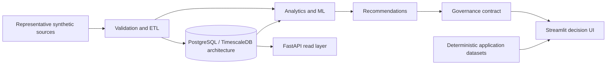

# Energy Operations Intelligence Platform (EOIP)

## Overview

EOIP is a Python engineering and data platform for renewable-energy operations
intelligence. It connects representative solar telemetry, operational events,
ETL controls, time-series persistence architecture, analytical models,
recommendations, governance contracts, a FastAPI service layer, and an
11-page Streamlit application.

The repository demonstrates how operational signals can move from validated
data contracts into forecasting, anomaly investigation, maintenance attention,
equipment-health views, and governed recommendations. Current empirical
evidence is representative synthetic engineering evidence—not production-scale
performance evidence. The Streamlit application currently reads deterministic
application/demo datasets through `src/eoip/app/data_access.py`; it must not be
described as a database-backed live application.

## Why EOIP exists

Renewable-energy teams often work across fragmented telemetry, alarms,
incidents, maintenance records, forecasts, and spreadsheets. This makes it hard
to compare actual and expected generation, prioritize investigation, evaluate
models honestly, and trace a recommendation back to evidence and assumptions.
EOIP provides a coherent engineering boundary for those concerns without
claiming commercial outcomes that have not been measured.

## Platform capabilities

| Capability | Implementation | Evidence status |
|---|---|---|
| Synthetic renewable-energy data | Deterministic plants, equipment, telemetry, weather, events, tariffs, and operations data | `REPRESENTATIVE_SYNTHETIC` |
| ETL | Validation, cleaning, incremental-loading, retry, audit, lineage, and Prefect boundaries | `PARTIAL`—production success rate not verified |
| PostgreSQL/TimescaleDB | SQLAlchemy models, Alembic migrations, hypertable and aggregate definitions | `CONFIGURED`; runtime benchmark `NOT VERIFIED` |
| Forecasting | Prophet with expanding-window comparison to Seasonal Naive | `VERIFIED` on representative data; mixed PASS/FAIL |
| Anomaly detection | Isolation Forest, residual, and statistical implementations | False-alert rate `PASS`; effectiveness mostly `NOT VERIFIED` |
| Predictive maintenance | Random Forest failure-risk pipeline | `VERIFIED` evaluation; discrimination criteria `FAIL` |
| Equipment health | Deterministic component score decomposition | Coverage/decomposition `PASS`; confidence `FAIL` |
| Recommendations | Optimization modules plus governed application recommendations | `PARTIAL`; representative source and no durable workflow |
| Governance | Stable IDs, lifecycle, ownership, evidence semantics, audit and financial boundaries | Domain contract `VERIFIED`; persistence `PARTIAL` |
| FastAPI | Typed authenticated read APIs, public health/readiness, and admin status | `VERIFIED` route registration and liveness; database-backed responses require configured persistence |
| Streamlit | 11-page filtered operations and intelligence interface | `VERIFIED` against deterministic application datasets |
| Testing | Unit, integration, acceptance, end-to-end, performance, security, and UI tests | `VERIFIED` in development environment; DB tests require configuration |

## Architecture



The database path is implemented and configured but not Phase O-certified. The
current UI path is the separate `data_access.py` demo boundary shown above.
See [system architecture](docs/architecture/SYSTEM_ARCHITECTURE.md).

## Intelligence pipeline


This is a navigation and decision workflow, not automatic causal lineage.
Shared plant/equipment identity may establish `RELATED_TO`; it does not by
itself establish `DERIVED_FROM`, `TRIGGERED_BY`, or `CAUSED_BY`.

## Application experience

| Group | Page | Purpose |
|---|---|---|
| Overview | Executive Dashboard | Portfolio production, exceptions, and governed priorities |
| Operations | Operations Dashboard | Current operational status and attention queues |
| Operations | Plant Performance | Actual/expected production and plant comparisons |
| Operations | Asset Dashboard | Equipment condition and asset drill-down |
| Operations | Alarms & Incidents | Operational events, response, and downtime context |
| Intelligence | Forecast Dashboard | Forecast series, bounds, and model context |
| Intelligence | Anomaly Dashboard | Detected abnormal behavior and related investigation |
| Intelligence | Maintenance Dashboard | Risk prioritization and equipment-health context |
| Intelligence | Recommendation Center | Governed recommendations, provenance, evidence, and financial availability |
| Platform | Data Quality | Application-dataset validation and quality measures |
| Platform | Administration | Safe platform/configuration information |

See the [Streamlit user guide](docs/app/STREAMLIT_USER_GUIDE.md).

## Empirical validation snapshot

| Area | Metric | Actual | Status |
|---|---|---:|---|
| Forecast | MAE improvement vs Seasonal Naive | -66.2719% | `FAIL` |
| Forecast | RMSE improvement | 13.8410% | `PASS` |
| Forecast | WAPE improvement | -66.2719% | `FAIL` |
| Forecast | Absolute bias | 1.8344% | `PASS` |
| Forecast | Interval coverage | 69.0972% | `FAIL` |
| Anomaly | False alerts per asset-day | 0.1667 | `PASS` |
| Anomaly | Precision / recall / F1 / critical recall / delay | No eligible truth events in test scope | `NOT VERIFIED` |
| Maintenance | PR-AUC | 0.007261 | `FAIL` |
| Maintenance | ROC-AUC | 0.515258 | `FAIL` |
| Maintenance | Precision | 0.011364 | `FAIL` |
| Maintenance | Top-5% recall | 0.041667 | `FAIL` |
| Data quality | Completeness / validity | 100% / 99.9573% | `PASS` |
| Data quality | Duplicates / missing records | 0% / 0% | `PASS` |
| Equipment health | Coverage / decomposition | 100% / within 6.94e-18 | `PASS` |
| Equipment health | Confidence | Unsupported | `FAIL` |
| Database | Clean migration and runtime benchmarks | Not executed | `NOT VERIFIED` |

The representative evidence demonstrates engineering and evaluation
infrastructure. It does **not** demonstrate production-scale model performance.

## Quick start

EOIP requires Python 3.12 (`>=3.12,<3.13`). From the repository root on
PowerShell:

```powershell
py -3.12 -m venv .venv
.\.venv\Scripts\Activate.ps1
python -m pip install --upgrade pip
python -m pip install -e ".[dev]"
Copy-Item .env.example .env
```

Set a local database password and API token secret in `.env` when exercising
those services. Start the applications with:

```powershell
python -m streamlit run src/eoip/app/main.py
python -m uvicorn eoip.api.app:app --reload --host 127.0.0.1 --port 8000
```

The Streamlit UI can run from its deterministic application data boundary
without PostgreSQL. Database-backed API behavior requires database setup.

## Testing

```powershell
python -m ruff check .
python -m black --check --no-cache --workers 1 .
python -m pytest tests/unit/app -q --basetemp .pytest_tmp_app
python -m pytest tests/ui -q --basetemp .pytest_tmp_ui
python -m pip check
git diff --check
```

For the full suite on Windows, give Prefect a writable repository-local home:

```powershell
$env:PREFECT_HOME = Join-Path (Get-Location) '.prefect_phase_n'
python -m pytest -q --basetemp .pytest_tmp_phase_n
```

Database integration tests skip when `EOIP_DATABASE_URL` is not configured.
See the [testing guide](docs/testing/TESTING_GUIDE.md).

## Reproducing Phase L evidence

The byte-stable evaluated timestamp command is:

```powershell
.\.venv\Scripts\python.exe scripts\generate_phase_l_evidence.py `
  --evaluated-at 2026-08-27T00:00:00+00:00
```

This writes to `artifacts/evaluation/phase_l/` using seed `20260827`. Do not
regenerate audited artifacts merely to improve results. See
[reproducibility](docs/evaluation/REPRODUCIBILITY.md) and the
[evidence index](docs/evaluation/EVIDENCE_INDEX.md).

## Repository structure

```text
src/eoip/app/          Streamlit application and deterministic data boundary
src/eoip/api/          FastAPI application, schemas, security, and routers
src/eoip/synthetic/    Representative data contracts and generation
src/eoip/etl/          Validation, loading, audit, lineage, and orchestration
src/eoip/database/     SQLAlchemy, repositories, services, and analytics
src/eoip/forecasting/  Forecast models, backtesting, evaluation, and storage
src/eoip/anomaly/      Detection, evaluation, alerts, and storage
src/eoip/maintenance/  Failure risk, health scoring, and prioritization
src/eoip/optimization/ Recommendations and technical/financial boundaries
src/eoip/governance/   Recommendation and financial traceability contracts
scripts/               Evidence and storage verification utilities
tests/                 Unit through end-to-end and performance tests
docs/                  Canonical technical and portfolio documentation
artifacts/evaluation/  Phase K/L evidence artifacts
```

## Current limitations

- Evidence is representative synthetic, not production evidence.
- Prophet failed MAE, WAPE, and interval-coverage criteria.
- Anomaly effectiveness metrics are mostly `NOT VERIFIED` because no eligible
  truth events occurred in the evaluated test period.
- Maintenance discrimination and precision are weak.
- Equipment-health confidence is not calibrated or verified.
- Database migration and query benchmarks remain `NOT VERIFIED`.
- ETL production success rate and recovery behavior remain `NOT VERIFIED`.
- No approved price, currency, cost, or horizon supports monetary conversion.
- Revenue at Risk, ROI, and realized benefit remain `NOT VERIFIED`.
- Recommendation governance writes are not durably persisted.

## Roadmap

- **Phase N — Documentation Closure:** this documentation and portfolio-readiness phase.
- **Phase O — Infrastructure Certification:** clean database, migration, container, API runtime, and performance verification.
- **Phase P — Model Improvement:** improve analytical models without weakening evidence criteria.
- **Phase Q — Final Re-audit:** final end-to-end success-criteria review.

## Documentation

Start with the [documentation index](docs/README.md), or use the
[portfolio case study](docs/portfolio/EOIP_CASE_STUDY.md) and
[interview guide](docs/portfolio/INTERVIEW_GUIDE.md) for a concise walkthrough.
