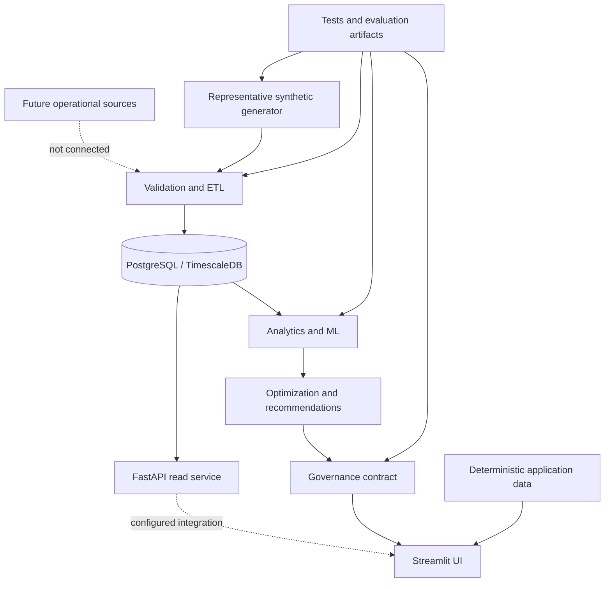
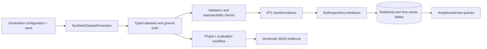
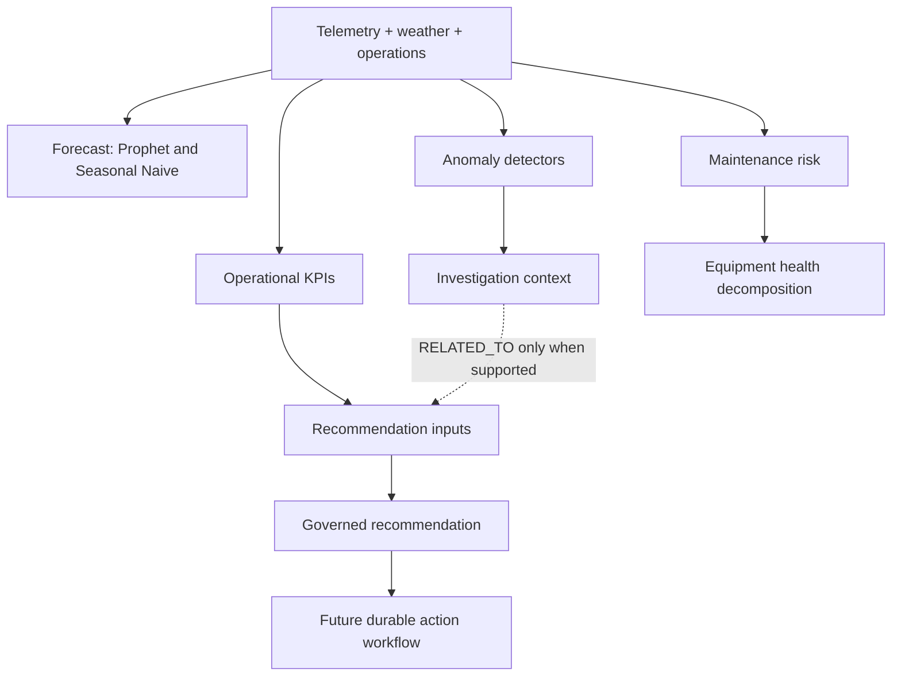
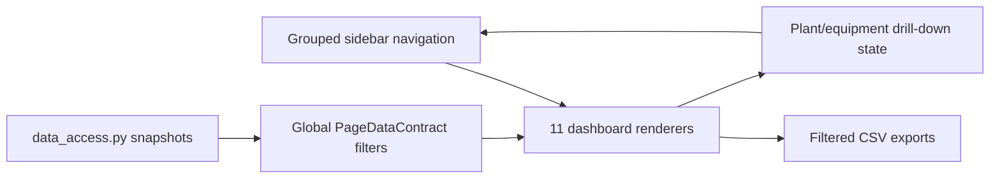

# EOIP system architecture

## Goals and evidence boundaries

EOIP separates data contracts, persistence, analytical computation, decision
support, governance, APIs, and presentation. The architecture favors explicit
units, UTC timestamps, reproducibility, validation, and honest unavailability.

Four boundaries must remain visible:

1. **Verified runtime:** behavior exercised by tests in the current environment.
2. **Configured architecture:** database, migrations, containers, and API routes
   that exist in code but are not Phase O-certified.
3. **Representative synthetic:** deterministic generated/application data used
   for engineering and evaluation.
4. **Future production:** live connectors, durable governance workflow,
   calibrated models, infrastructure performance, and operational SLAs.

## System context

The solid demo-to-UI path reflects the current application. The configured API
and database architecture is separate; Streamlit does not currently prove a
database-backed runtime path.

## Major packages

| Package | Responsibility | Current boundary |
|---|---|---|
| `synthetic` | Domain models, deterministic generation, event scheduling, metadata | Representative synthetic |
| `etl` | Ingestion, validation, cleaning, transformation, retry, audit, lineage, Prefect | Implementation verified; production run partial |
| `database` | ORM models, repositories, services, bulk loading, analytics queries | Configured; DB runtime not verified |
| `analytics.kpi` | Unit-aware operational KPI calculations | Unit-tested |
| `forecasting` | Prophet/naive models, backtesting, comparison, storage | Representative evaluation |
| `anomaly` | Isolation Forest, residual/statistical detection, evaluation, alerts | Representative evaluation |
| `maintenance` | Future-failure labels, Random Forest risk, health, prioritization | Representative evaluation |
| `optimization` | Energy-loss, recoverable-energy, cost, recommendation prioritization | Unit-tested boundaries |
| `governance` | Identity, lifecycle, ownership, evidence, audit, financial assumptions | Domain verified; durable storage absent |
| `api` | Typed FastAPI routes, bearer authentication, provider boundary | Route registration and liveness verified; DB-backed behavior configuration-dependent |
| `app` | Streamlit pages, filters, navigation, deterministic data boundary | UI tested |

## Data flow

Generated ground truth is scheduled independently before detector execution.
Phase L uses seed `20260827`, UTC timestamps, and chronological splits.

## Analytics and intelligence flow

The current recommendation generator must not be described as causally driven
by anomalies, incidents, or forecasts unless its input path establishes that
relationship. Model scores are not converted to money without complete,
versioned business assumptions.

## Application and UI flow

The application uses custom sidebar navigation and session state, not
Streamlit's multipage router. This is verified current behavior, not a claim
that it is the only possible production architecture.

## FastAPI and security

The configured API prefix is `/api/v1`. OAuth2-compatible bearer tokens use a
signed expiring token. Viewer, operator, and admin roles can read; `/admin/status`
requires admin. Recommendation routes are read-only.

Fresh-process inspection of the module-level `app` during Phase N confirmed all
24 configured OpenAPI paths. A `TestClient` request to `/api/v1/health`
returned HTTP 200. Database-backed response behavior and readiness still depend
on a configured persistence environment and are not Phase O-certified.

## Persistence architecture

SQLAlchemy models cover plants, equipment, SCADA, weather, alarms, incidents,
work orders, budgets, tariffs, and synthetic ground truth. Alembic defines the
base schema, forecast/anomaly storage, operational views, hypertables, and
continuous aggregates. Clean migration, representative load, continuous
aggregate execution, and query-performance criteria remain `NOT VERIFIED`.

## Testing and evidence

Tests span unit, integration, acceptance, end-to-end, performance, security,
UI, and optional PostgreSQL integration. Phase K artifacts describe evaluation
capabilities; Phase L artifacts record representative empirical results. See
[reproducibility](../evaluation/REPRODUCIBILITY.md).
