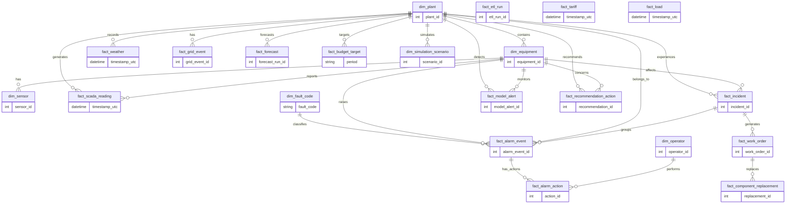

# Energy Operations Intelligence Platform - Entity Relationship Diagram

```mermaid
erDiagram

    dim_plant ||--o{ dim_equipment : contains
    dim_equipment ||--o{ dim_sensor : has

    dim_plant ||--o{ fact_scada_reading : generates
    dim_equipment ||--o{ fact_scada_reading : reports

    dim_plant ||--o{ fact_weather : records

    dim_fault_code ||--o{ fact_alarm_event : classifies
    dim_equipment ||--o{ fact_alarm_event : raises
    dim_plant ||--o{ fact_alarm_event : belongs_to

    fact_alarm_event ||--o{ fact_alarm_action : has_actions
    dim_operator ||--o{ fact_alarm_action : performs

    fact_incident ||--o{ fact_alarm_event : groups
    fact_incident ||--o{ fact_work_order : generates

    fact_work_order ||--o{ fact_component_replacement : replaces

    dim_plant ||--o{ fact_incident : experiences
    dim_equipment ||--o{ fact_incident : affects

    dim_plant ||--o{ fact_grid_event : has

    dim_plant ||--o{ fact_forecast : forecasts

    dim_plant ||--o{ fact_budget_target : targets

    dim_plant ||--o{ fact_model_alert : detects
    dim_equipment ||--o{ fact_model_alert : monitors

    dim_plant ||--o{ fact_recommendation_action : recommends
    dim_equipment ||--o{ fact_recommendation_action : concerns

    dim_plant ||--o{ dim_simulation_scenario : simulates

    fact_etl_run {
        int etl_run_id
    }

    dim_plant {
        int plant_id
    }

    dim_equipment {
        int equipment_id
    }

    dim_sensor {
        int sensor_id
    }

    dim_fault_code {
        string fault_code
    }

    dim_operator {
        int operator_id
    }

    dim_simulation_scenario {
        int scenario_id
    }

    fact_scada_reading {
        datetime timestamp_utc
    }

    fact_weather {
        datetime timestamp_utc
    }

    fact_alarm_event {
        int alarm_event_id
    }

    fact_alarm_action {
        int action_id
    }

    fact_incident {
        int incident_id
    }

    fact_grid_event {
        int grid_event_id
    }

    fact_work_order {
        int work_order_id
    }

    fact_component_replacement {
        int replacement_id
    }

    fact_tariff {
        datetime timestamp_utc
    }

    fact_load {
        datetime timestamp_utc
    }

    fact_budget_target {
        string period
    }

    fact_forecast {
        int forecast_run_id
    }

    fact_model_alert {
        int model_alert_id
    }

    fact_recommendation_action {
        int recommendation_id
    }
```
